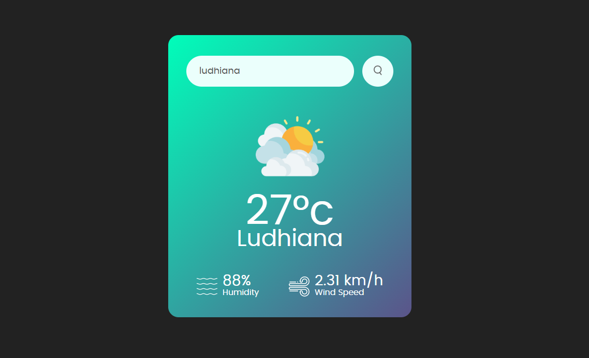

# 🌦️ Weather App

A simple and interactive weather application that provides real-time weather updates for any location.  
Built using **HTML, CSS, JavaScript**, and powered by the **OpenWeatherMap API**.

---

## 📸 Screenshots



---

## 🚀 Features

- 🔍 **Search by City Name** – Get weather details for any city in the world.
- 📍 **Current Location Weather** – Automatically fetches weather data using your device location.
- 🌡 **Real-Time Temperature Display** – Shows live temperature updates in Celsius.
- 🌦 **Weather Conditions** – Displays conditions like sunny, cloudy, rainy, and snowy.
- 💨 **Additional Weather Data** – Shows humidity, wind speed, and pressure.
- ⚡ **Fast & Lightweight** – Minimal load time with responsive UI for all devices.

---

## 🛠️ Technologies Used

- **Frontend:** HTML, CSS, JavaScript
- **API:** [OpenWeatherMap API](https://openweathermap.org/api)
- **Version Control:** Git & GitHub

---

## 📥 Installation Steps

1. **Clone the repository**
    ```bash
    git clone https://github.com/yourusername/weather-app.git
    ```

2. **Move into the project folder**
    ```bash
    cd weather-app
    ```

3. **Set up your API Key**
    - Open the `script.js` (or main JavaScript file).
    - Replace the existing `apiKey` value with your own key from OpenWeatherMap:
      ```javascript
      const apiKey = "your_api_key_here";
      const apiUrl = "https://api.openweathermap.org/data/2.5/weather?units=metric&q=";
      ```

4. **Run the project**
    - Open the `index.html` file in your browser.

---

## 📄 License

This project is licensed under the **MIT License** – see the [LICENSE](LICENSE) file for details.

---

## 👨‍💻 Author

**Anil Joiya**  
📧 Email: aniljoya23@gmail.com  
🌐 GitHub: [aniljoiya](https://github.com/aniljoiya)
